# Sockit Socket.IO Library — Architecture Diagrams

> Derived from [`architecture.md`](./architecture.md), [`implementation-plan.md`](./implementation-plan.md), [`execution-state.md`](./execution-state.md).

---

## 1. Repository layout

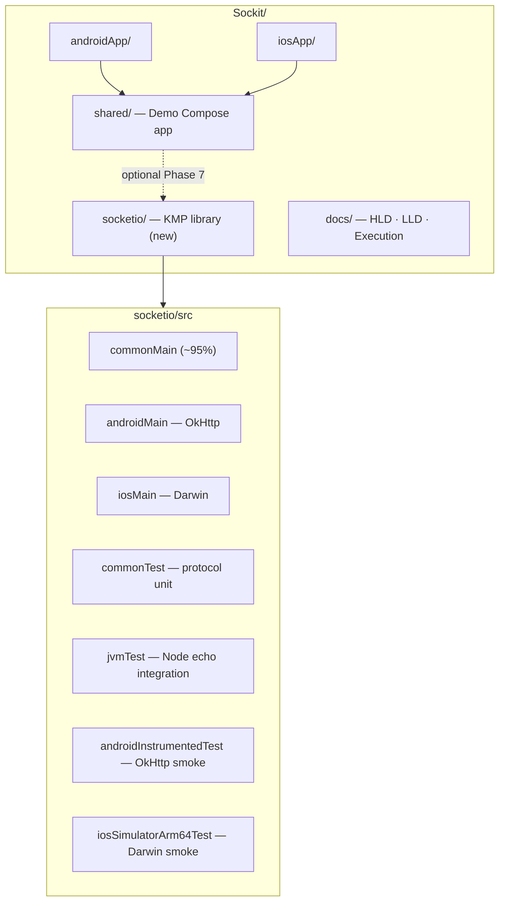

---

## 2. Layered architecture (bottom → top)

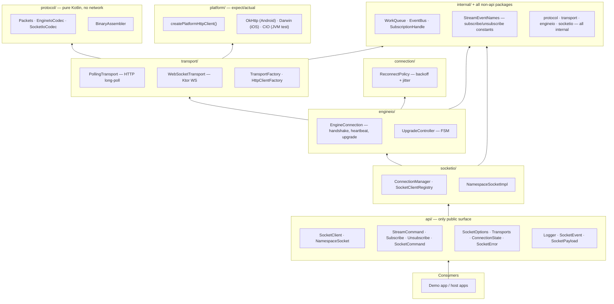

---

## 3. Threading model

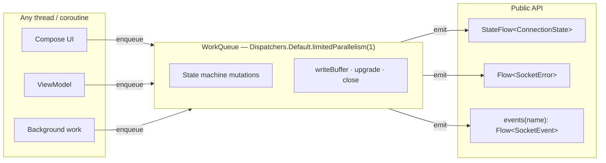

---

## 4. Runtime object graph (multiplexing)

```mermaid
flowchart TB
    subgraph registry["SocketClientRegistry (internal)"]
        KEY["cache key: scheme://host:port"]
        REF["ref count per ConnectionManager"]
    end

    subgraph client1["SocketClient (app-owned)"]
        NS1["NamespaceSocket /"]
        NS2["NamespaceSocket /futures"]
    end

    subgraph manager["ConnectionManager"]
        ENG["EngineConnection — one physical link"]
        RP["ReconnectPolicy"]
    end

    subgraph transports["Active transport"]
        POLL["PollingTransport"]
        WS["WebSocketTransport"]
    end

    client1 -->|namespace()| NS1 & NS2
    client1 -->|multiplex=true| registry
    registry -->|cache hit| manager
    NS1 & NS2 --> manager
    manager --> ENG
    ENG --> POLL
    ENG -.->|upgrade| WS
    ENG --> RP

    FORCE["forceNew=true"] -.->|bypass cache| manager
    DIFF["different URL"] -.->|new manager| manager
```

| Config | Physical engines | Notes |
|--------|------------------|-------|
| Same URL, `multiplex=true` | 1 | Namespaces share engine; reconnect affects all |
| Same URL, `forceNew=true` | N | Independent; not in global cache |
| Different URLs | N | Independent managers |

---

## 5. Connection lifecycle sequence

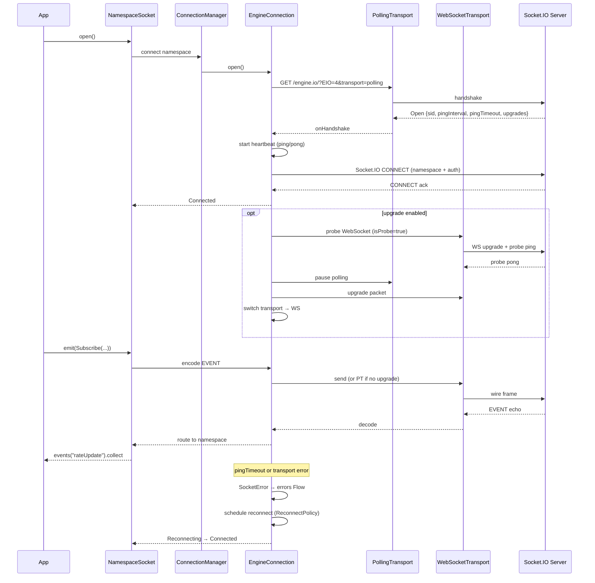

---

## 6. Upgrade FSM (gap #1 — drain race fix)

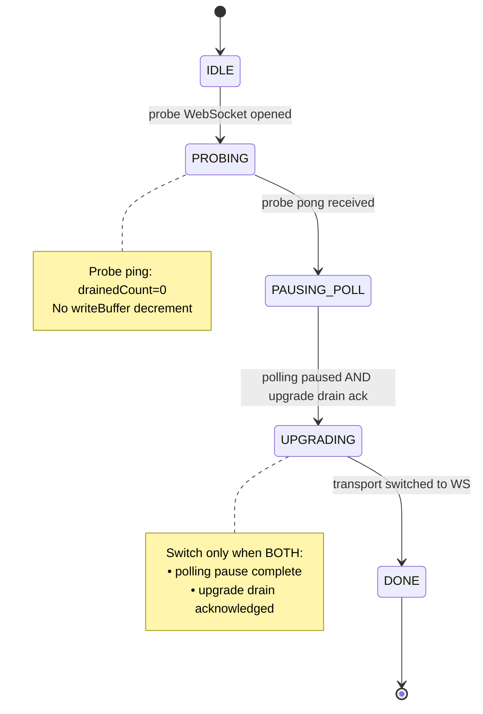

**Defensive `onDrain`:** if `count > writeBuffer.size` → log + no-op (never throw).

---

## 7. Error propagation (gap #2, #6)

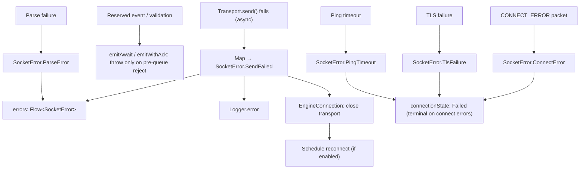

| Surface | When |
|---------|------|
| `connectionState: StateFlow` | Lifecycle; `Failed` is terminal until `open()` again |
| `errors: Flow` | Send failures while connected, parse warnings, glitches before reconnect |
| `Logger.error` | Always — internal detail + throwable |
| `emitAwait` | Completes when the event is **queued** (WorkQueue → engine writeBuffer); does **not** await transport drain |
| Async transport `SendFailed` | `errors` only — does not fail a prior `emitAwait` that already returned |

---

## 8. Wire protocol stack

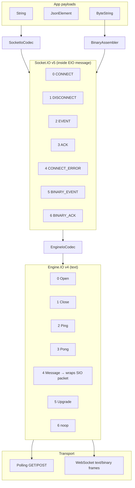

---

## 9. HttpClient & SocketOptions resolution

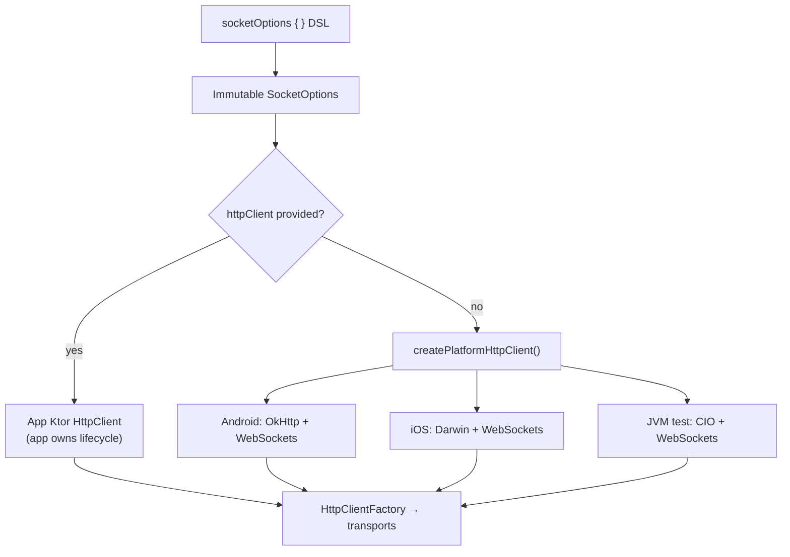

---

## 10. Implementation phases (LLD pipeline)

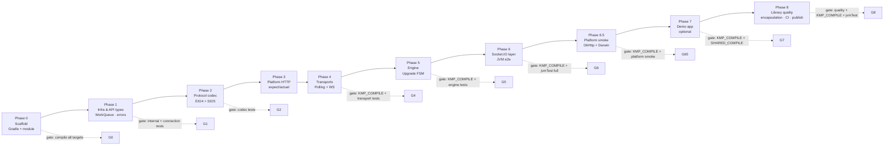

---

## 11. Agent execution workflow

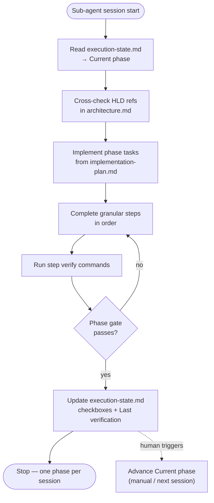

**Doc chain:** `architecture.md` (HLD) → `implementation-plan.md` (LLD) → `execution-state.md` (execution).

---

## 12. Testing pyramid

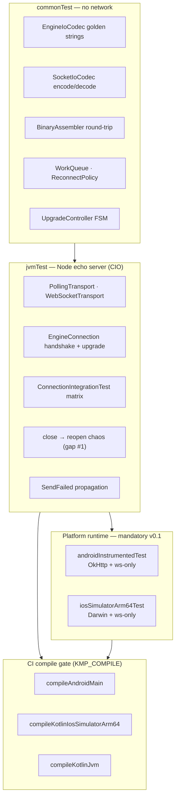

---

## 13. Public API usage (app perspective)

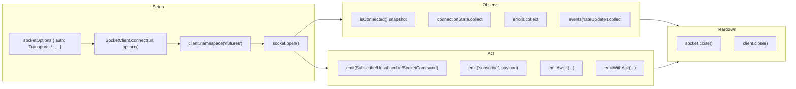

---

---

## 14. API encapsulation boundary

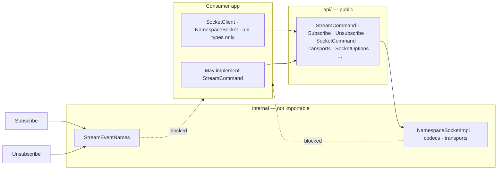

---

## 16. Library quality tooling (Phase 8)

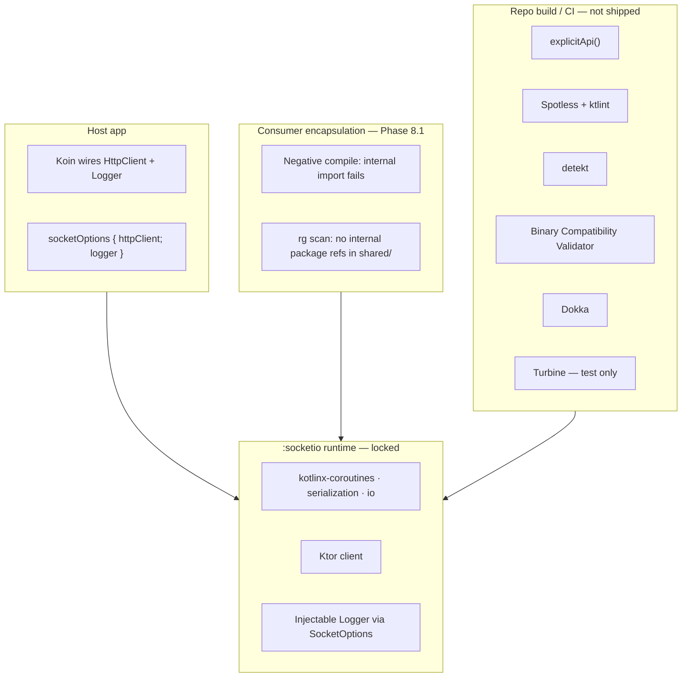

**Rule:** detekt, ktlint, Dokka, BCV, Turbine, Koin — never in `:socketio` `implementation()` dependencies.

---

## 17. Gap prevention map (kmp-socketio)

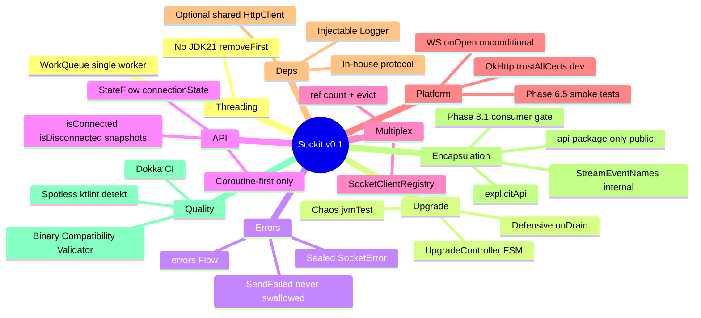
